# Basic Virtual Reality Development

## Required Equipment

* **Google Cardboard**
*  An **Android smart phone** capable of running the Google Cardboard app
 * Cardboard on an Android phone requires version 4.1 or higher
* A **laptop** capable of running Unity 3D
 * OS: Windows 7 SP1+, 8, 10; Mac OS X 10.8+. Windows XP and Vista are not supported; and server versions of Windows & OS X are not tested.
 * GPU: Graphics card with DX9 (shader model 3.0) or DX11 with feature level 9.3 capabilities
* A **USB cable** for connecting the phone to the laptop

## Required Software

You will need to download and install the following software in the order provided.

1. [Visual Studio 2015 Community Edition](https://www.visualstudio.com/downloads/)

  Follow the link above  and choose *Visual Studio Community* and follow the directions.

2. [Unity 3D Daydream Technical Preview](https://unity3d.com/partners/google/daydream)

  Scroll down close to the bottom of the page to the download section.  Download and install the latest release for your operating system.  Make sure that *Android Build Support* is enabled as shown below.

  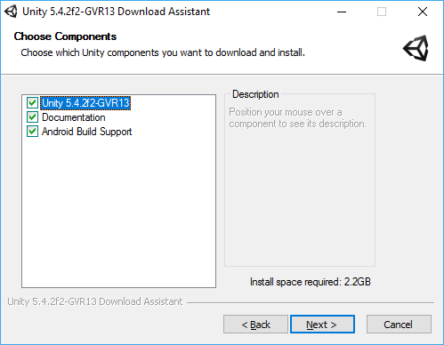

3. [Google VR SDK for Unity](https://developers.google.com/vr/unity/download#google-vr-sdk-for-unity)

  Download this Unity package to a folder where it is easy to find later, for instance, your Desktop.

### Additional Directions

Alternatively, you may follow the [directions provided by Google](https://developers.google.com/vr/unity/get-started).  Just note that we will not be using all of the components included in the Google VR SDK.

## Creating a Project

1. Start **Unity Daydream Preview**.  Choose new project and give your project a name and a location.

	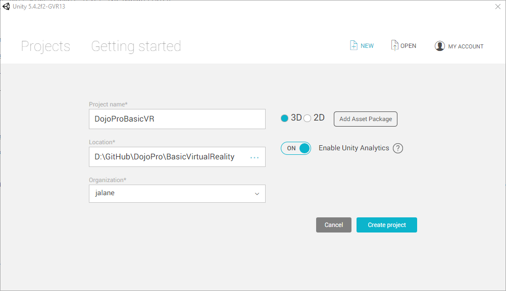

## Setting the Build/Player Settings
	
1. Next, choose **Build Settings...** from the **File** menu.

	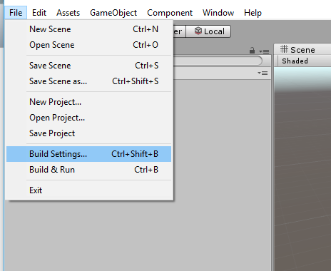

2. Make sure that **Android** is selected, and then press the **Switch Platform** button in the bottom left corner.

	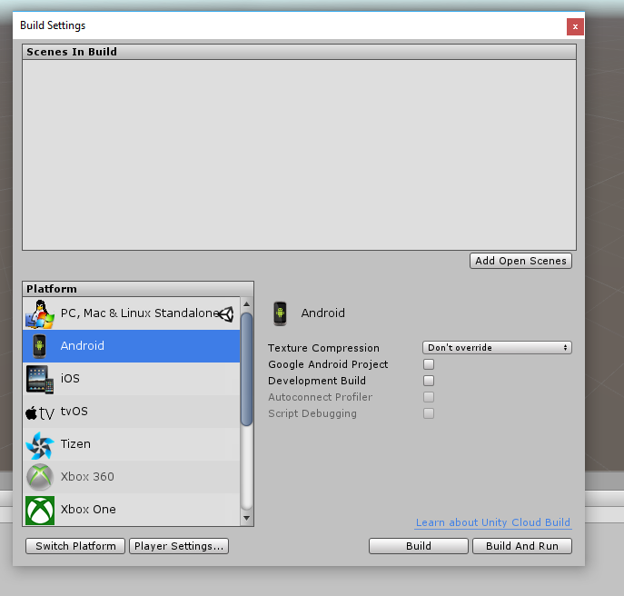
	
3. Next, press the **Player Settings...** button next to the **Switch Platform** button you pressed in the previous step.  This will cause the Player Settings to appear in the Inspector to the far right in the Unity editor.  You can close the build settings window since we won't need it.

	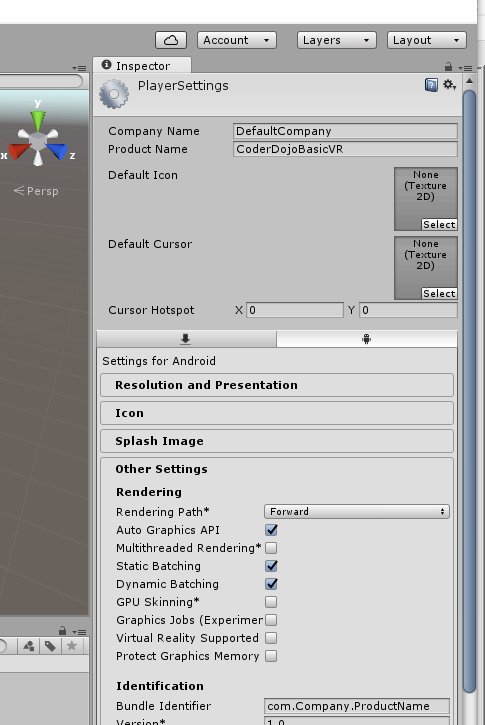
	
4. Enable the **Virtual Reality Supported** checkbox.  Then click the **+** to add a virtual reality SDK and select **Cardboard**.

	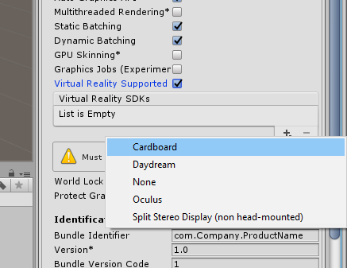
	
5. Also make sure to change the **Bundle Identifier** and set the **Minimum API Level** to Android 4.4 (API level 19).

	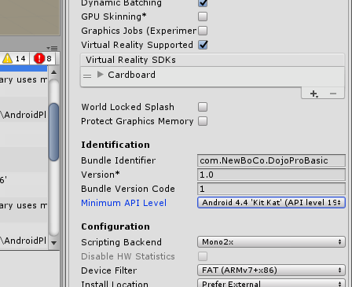
	
## Importing the Google VR SDK

1. Select **Assets** &rightarrow; **Import Package** &rightarrow; **Custom Package...** and then navigate to where you placed the `GoogleVRForUnity.unitypackage` file and open it.

	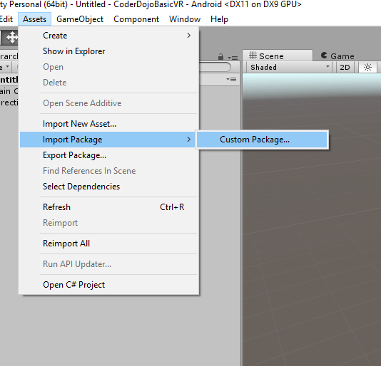
	
2. We won't be using the demos so uncheck the **Demos** checkbox and press the **Import** button.

	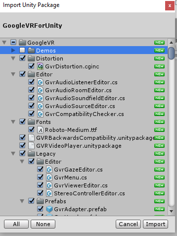
	
## Create Folders for Later and Save the Scene

1. At the bottom left of the Unity editor is the project window.  Select the top-level **Assets** folder.  To create a folder, either right-click on the **Assets** folder itself, or in the right pane of the project window and select **Create** &rightarrow; **Folder**.

	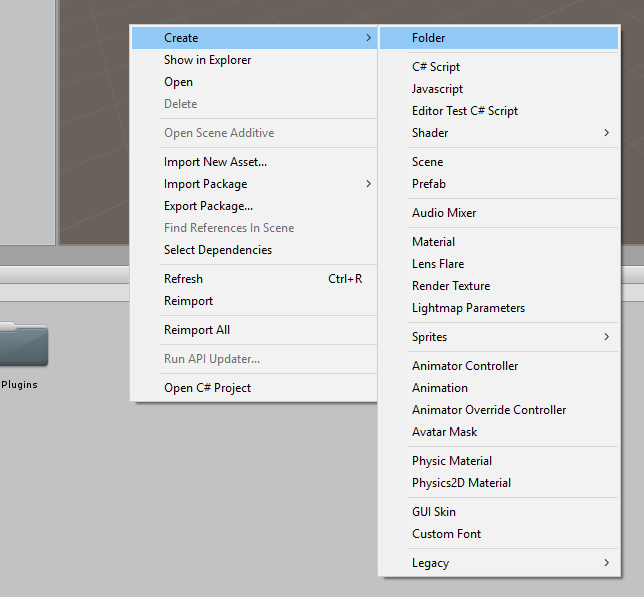
	
	We will create three folders and name them **Scenes**, **Prefabs**, and **Scripts**.
	
	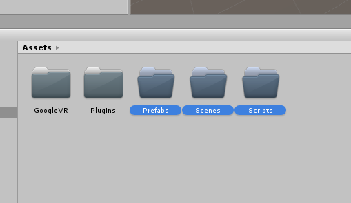
	
2. Finally, select **File** &rightarrow; **Save Scene** and save the scene as `MyScene` in the `Scenes` directory.

## Setting Up the VR View

1. In order to be able to see how the Cardboard app will look on the phone, we want to add a game object that will render stereo in the Unity editor game mode.  To do this click on the **GoogleVR** folder in the project window.  In the search bar (top right of the project window) type `gvrviewer`.  Drag the GvrViewer prefab from the project window to the hierarchy window.

	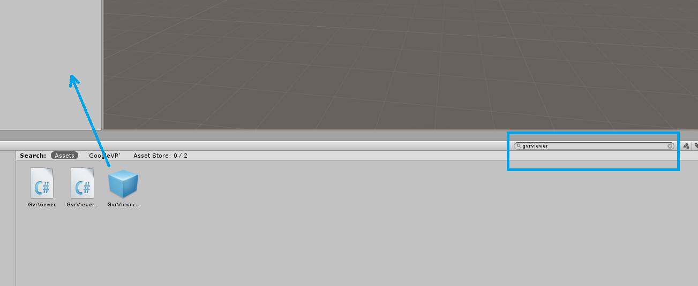
	
2. The GvrViewerMain game object should have been created in the hierarchy view.  Click the triangular play button above the scene view.  In a few moments you should see a stereo render of your scene.

	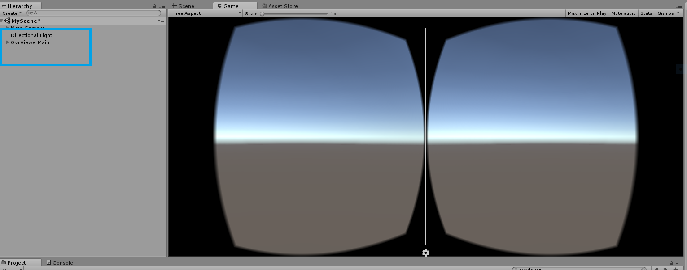
	
## Create the Ground Plane

1. In the hierarchy window right-click in a blank area and select **3D Object** &rightarrow; **Plane**.

	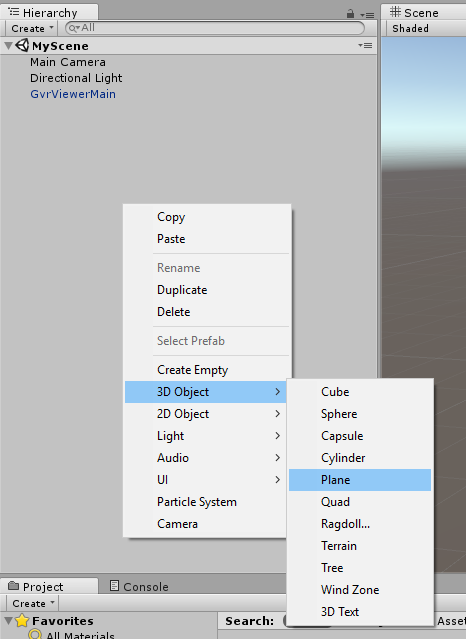
	
2. Next, right-click on the new plane and rename it to `Ground`.

	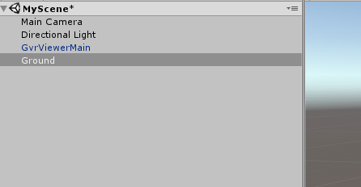
	
3. Making sure that **Ground** is selected in the hierarchy window, edit the transform component in the inspector (upper right of the Unity editor) as shown below.  Enter in zeros for all of the position and rotation components and (10, 1, 10) for the scale components.

	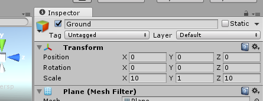
	
4. Press play again so you can see the new ground plane.

	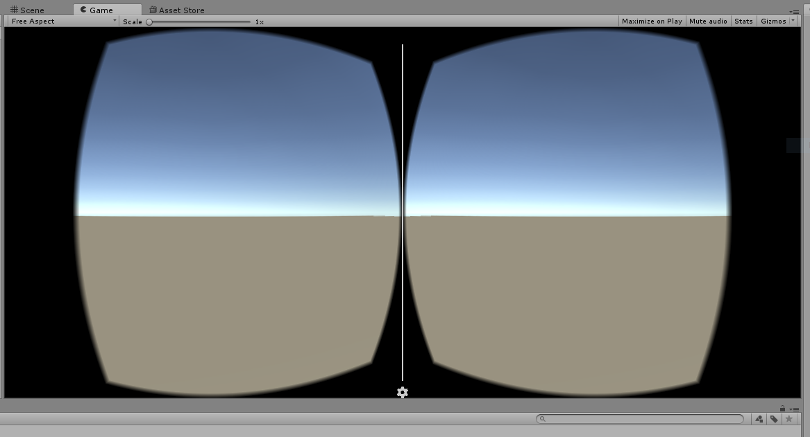
	
## Navigate to the Camera (Roughly)

1. Using the right mouse button to rotate the view, and the middle mouse button to translate, and the mouse scroll wheel to zoom, position the scene view to be at the camera's position and orientation.

	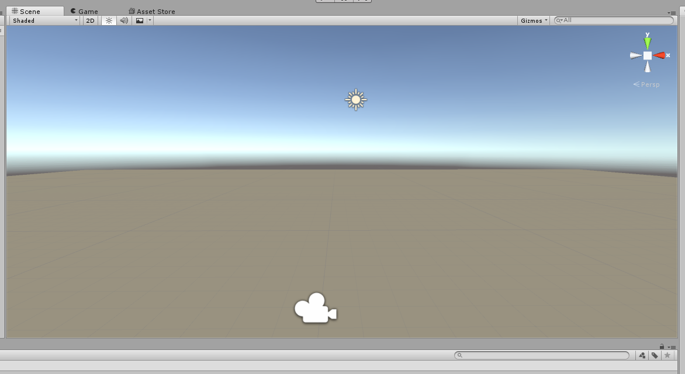
	
## Box and Ball Prefabs

1. First, select the **Prefabs** folder down in the project window.

2. Next, right-click in the hierarchy window and select **3D Object** &rightarrow; **Cube**.

3. Drag the cube down into the Prefabs folder and rename it `Box`.

4. Similarly, create a sphere in the hierarchy window, drag it down to the Prefabs folder, and rename it `Ball`.

5. Delete the cube and sphere from the hierarchy window, but make sure to leave the prefabs.

## Make the Box and Ball Physics objects

1. Select the Box prefab we just created down in the Prefabs folder.

2. Next, edit the transform component so that when we drag new Box prefabs to the hierarchy view, they will show up at the origin.  The position components should be set to (0, 0.5, 0) so that the Box rests on the ground plane.  The rotation and scale components should be OK with the default settings.

3. Now, in the inspector click the **Add Component** button and select **Physics** &rightarrow; **RigidBody**.  This will make it so that the Box can interact with other objects in the app.

	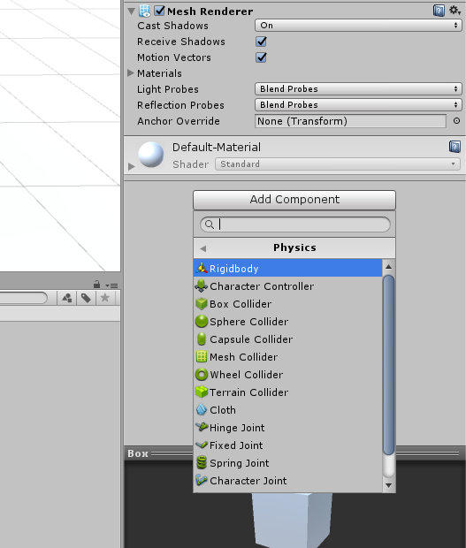
	
4. Follow the last steps for the Ball as well.

## Start Scripting!

1. Now we need to be able to throw balls at our blocks.  Select the MainCamera in the hierarchy window.

2. In the inspector press the **Add Component** button, scroll down to the bottom of the menu and select **New Script** and name the script `ThrowBall`.

	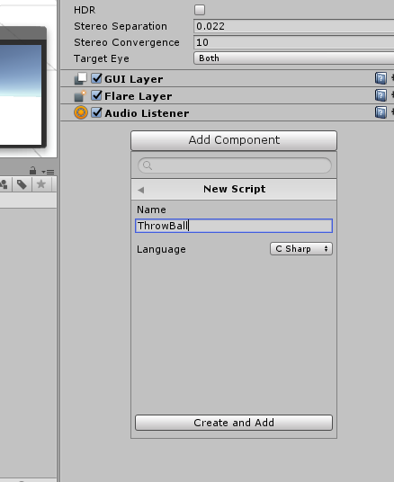
	
3. Next, in the new script component, right-click on the small C# icon, and select **Edit Script**.

	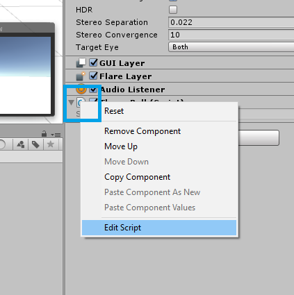
	
4. This should bring up Visual Studio with the file `ThrowBall.cs` in the editor.

	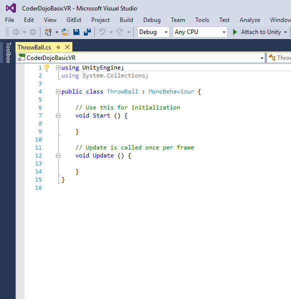
	
5. We need to make three new, public variables for our script to use.
	* We need a `RigidBody` that will be our thrown ball.  We'll call it `ball`.
	* We need a `Transform` so we know where to throw the ball from. We'll call it `throwPosition`.
	* We need a `float` to represent how hard we'll throw the ball.  We'll call it `throwForce`.
	 
	 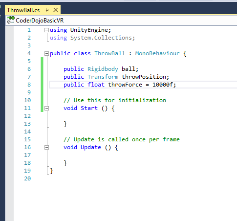
	 
6. Remove the `Start` method, we won't be needing it.

	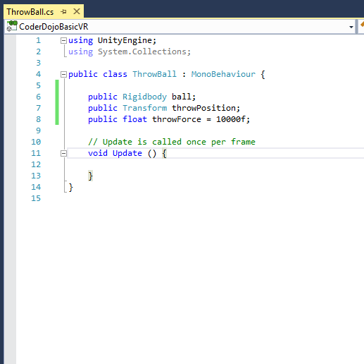
	
7. In the `Update` method, we need to create a ball and throw it if the button is pressed.  Add the following code to the Update method.

	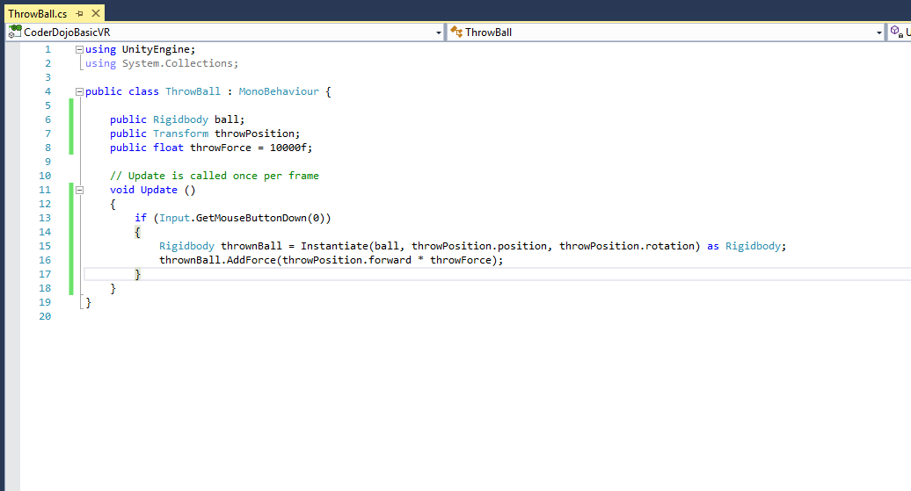
	
8. Finally, in the project window, select the top-level **Assets** folder.  Then drag the `ThrowBall` script into the **Scripts** folder, just to keep things tidy.
	
## Create a `ThrowPosition` Game Object

1. We need a position object to give our `ThrowBall` script so that it knows where to throw the ball.  Since we want the ball to be aimed where we are looking, make an *Empty* game object that is a child of the MainCamera by right-clicking on the MainCamera and selecting *Create Empty*.

2. Rename the empty object "ThrowPosition".

## Add Components to the ThrowBall Script

1. Notice that the public variables that we made earlier are listed under the ThrowBall script in the inspector when the MainCamera is selected in the hierarchy window.

	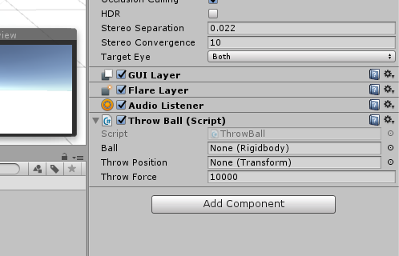
	
2. In order to be able to throw balls, we need to hook these variables up to our Ball prefab and our ThrowPosition object.  We do this by simply dragging each of them to the appropriate area of the inspector.  Note that Unity is smart enough to not allow you to drop the wrong object on a variable.

	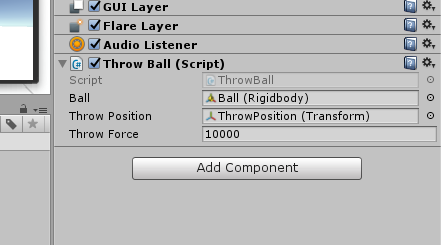
	
3. Press play and then left click with the mouse in the scene window.  You should be throwing balls!

	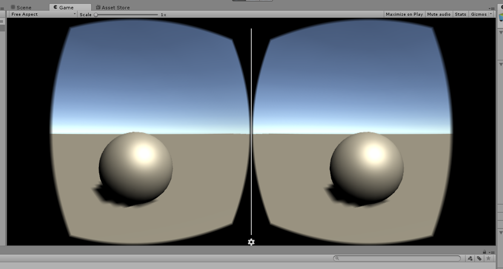
	
## Add Some Boxes to Knock Download

1. Drag the *Box* prefab from the project window to the hierarchy window.  You should see a box created in the center of your ground plane.

	
	
2. Now we want to duplicate our box and make a stack.  Do this by keying *Ctrl-D*.  The new box should appear in the hierarchy window, but since it is created with the same transform as your first box you must move it to see it.  Do this by holding down the *Ctrl* key and dragging up on the green Y axis arrow.  Holding down *Ctrl* translates the box by one unit which works perfectly since our boxes are one unit in size.

	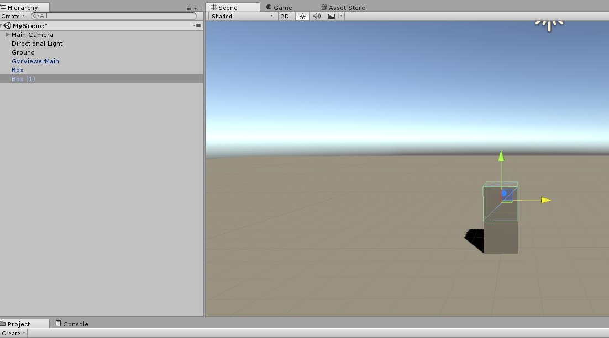
	
3. Do step 2 a couple more times to make a stack of four boxes.

	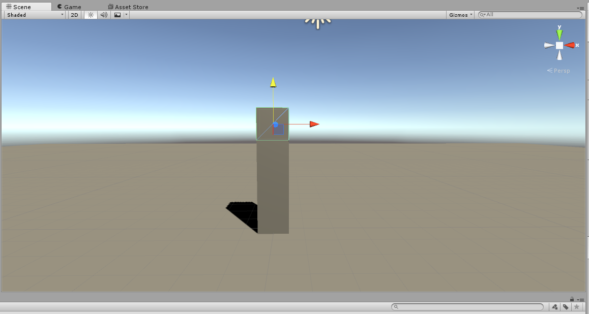
	
4. Now press play and try to knock them down!  Hold down the *Alt* key while moving the mouse within the scene window to tilt the camera around.  Left click the mouse to throw.

	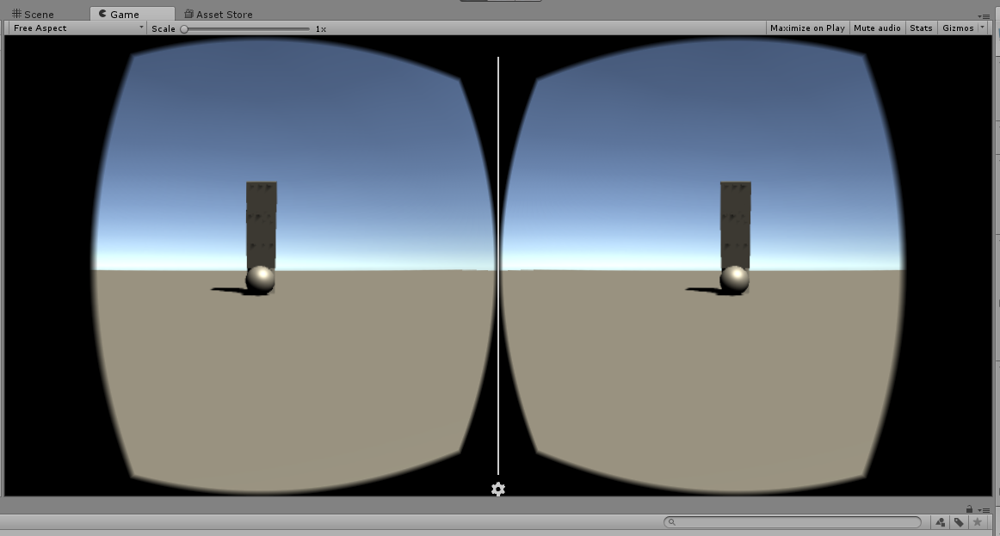
	
## Make the Balls Mortal

1. If we just continue throwing balls they will stay around in our world as long as it's running.  After a while this will slow down our game and clutter it up.  Therefore, let's make the balls destroy themselves after a short time.  Start by selecting the ball prefab and adding a new script component named "DestroyBall".

2. We don't need the *Update* method so delete it.

	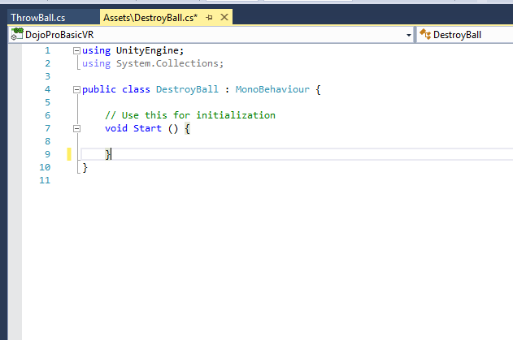

3. Next, we'll tell the ball to destroy itself by calling the *Destroy* method and giving it 5 seconds to live.

	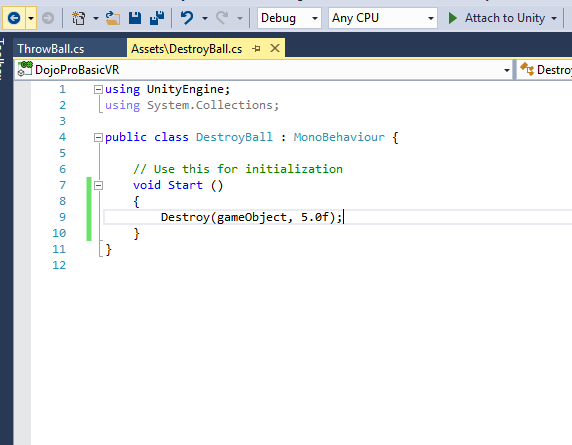
	
4. Press play and shoot a few balls.  After 5 seconds you should see the balls removing themselves from the hierarchy window and disappearing from the scene.

## Add a Reticle

1. It would be nice to have a better idea where we are aiming, so let's add a reticle.  First, select the *GoogleVR* folder in the project window.

2. Next, search for "gvrreticle".

3. Then, drag the GvrReticlePointer prefab onto the MainCamera.

4. Press play and you should see a little white dot on your stack of boxes.

	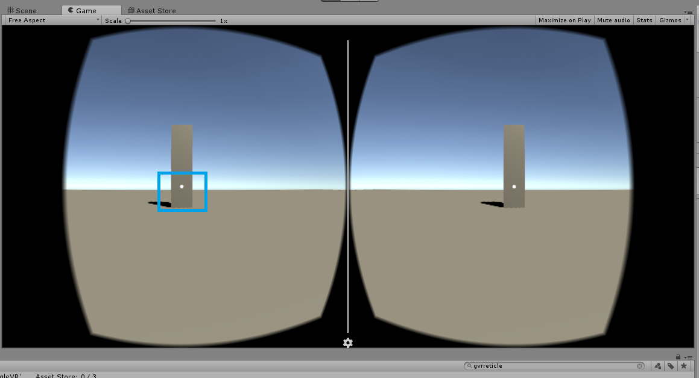
	
## Time to Build and Deploy!!!

1. First make sure that your Android phone has USB debugging enabled.  This option is in the developer's options.  If you do not see developer's options, they are typically enabled by navigating to the *Build number* entry in your settings (usually under *About*) and tapping it until the developer's options are unlocked.  I believe my phone required 8 taps.

2. Next, open *Build Settings* and double-check that your scene is listed in the *Scenes In Build* pane.  If not, press the *Add Open Scenes* button.

	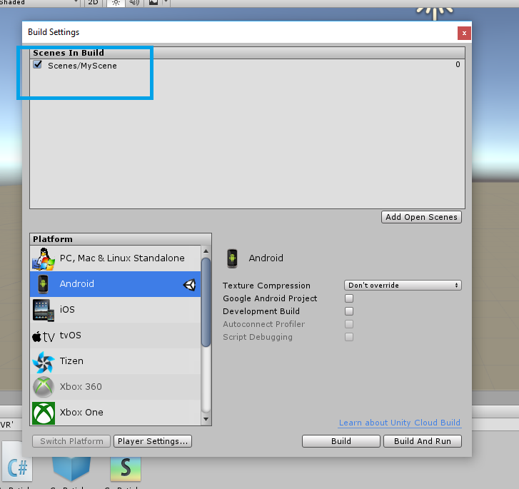
	
3. Press the *Build and Run* button and save the APK file to your project directory.

	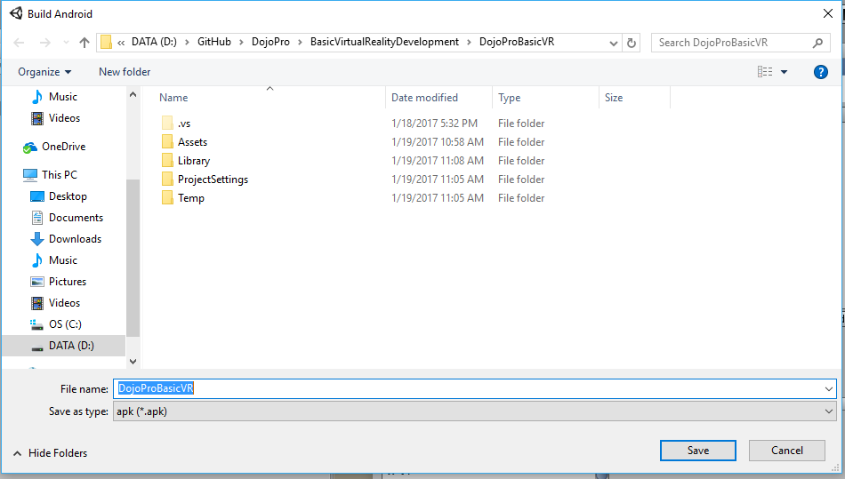
	
4. The game will take a little while to build, but then should start running on your phone.  You may need to unlock your phone for the game to start.  If it does not build, I will help you troubleshoot!

5. Turn your phone sideways and tap the screen.  You should see balls being thrown at your stack of boxes.  If not, we'll troubleshoot!

6. Exit out of the game.

## PLAY!

Your game is now installed on your phone.  Find it in your applications, start it, and put it into your Google Cardboard and play!
